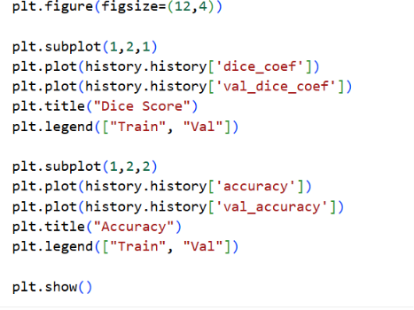
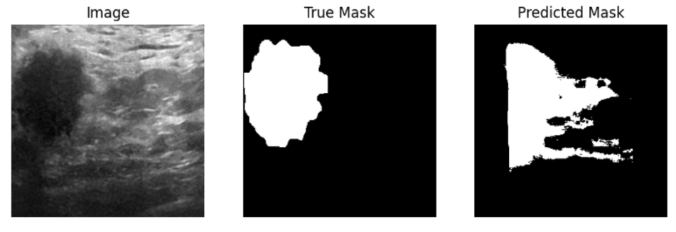
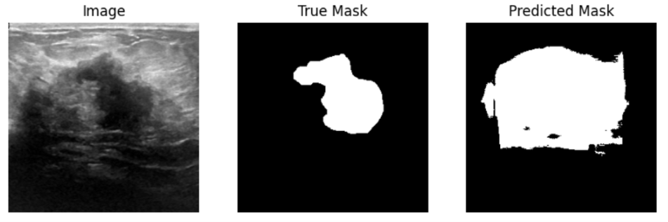

# Breast Cancer Segmentation Using U-Net

Breast Cancer Segmentation using U-Net is a deep learning project that detects and segments tumor regions from medical images. The model uses image preprocessing, augmentation, and a U-Net architecture to improve segmentation accuracy and support early breast cancer diagnosis using AI techniques.

## Overview

This project focuses on Breast Cancer Segmentation using U-Net, a deep learning architecture widely used for biomedical image segmentation. The model is trained to identify and segment cancerous regions from breast medical images such as ultrasound, mammograms, or MRI scans.

The main objective is to assist in early detection and accurate localization of tumors, helping improve medical diagnosis and treatment planning.

## Features

- Medical image preprocessing and augmentation
- U-Net based deep learning architecture
- Tumor region segmentation
- High accuracy image mask prediction
- Visualization of segmented outputs
- Performance evaluation using segmentation metrics

## Technologies Used

- Python
- TensorFlow / Keras
- OpenCV
- NumPy
- Matplotlib
- Scikit-learn

## Dataset

The project uses breast cancer medical imaging datasets containing:
- Input medical images
- Corresponding segmentation masks

**Example datasets:**
- Breast Ultrasound Images Dataset
- Mammography datasets
- Custom annotated medical datasets

## U-Net Architecture

U-Net is a convolutional neural network specially designed for biomedical image segmentation. It consists of:

- **Encoder Path** – Extracts image features
- **Bottleneck Layer** – Captures deep information
- **Decoder Path** – Restores spatial information
- **Skip Connections** – Improve localization accuracy

## Installation

Clone the repository:
```bash
git clone https://github.com/Saikiran58ravula/Breast-Cancer-Segmentation-Using-U-Net-.git
cd Breast-Cancer-Segmentation-Using-U-Net-
```

Install dependencies:
```bash
pip install -r requirements.txt
```

## Usage

Run training:
```bash
python train.py
```

Run prediction:
```bash
python predict.py
```

Evaluate model:
```bash
python evaluate.py
```

## Model Performance

| Metric | Score |
|---|---|
| Dice Coefficient | 0.XX |
| IoU (Intersection over Union) | 0.XX |
| Accuracy | 0.XX |
| Precision | 0.XX |
| Recall | 0.XX |

## Screenshots

### Training Metrics


### Prediction Samples



## Output Samples

| Input Image | Ground Truth Mask | Predicted Mask |
|---|---|---|
| Breast Scan | Tumor Region | Segmented Tumor |

## Project Structure

Breast-Cancer-Segmentation-U-Net/

│

├── dataset/

├── models/

├── outputs/

├── notebooks/

├── train.py

├── predict.py

├── evaluate.py

├── requirements.txt

└── README.md


## Applications

- Early breast cancer detection
- Medical image analysis
- Tumor localization
- Clinical decision support systems

## Future Enhancements

- Integration with attention U-Net
- Real-time segmentation system
- Deployment using Flask/Streamlit
- Multi-class tumor segmentation

## Contributing

Contributions are welcome! Feel free to fork the repository and submit pull requests.

## License

This project is licensed under the MIT License.

## Author

Developed by **Saikiran Ravula** as part of an academic/research project on deep learning for medical image segmentation.

## Acknowledgements

Thanks to the open-source community and dataset providers whose work made this project possible.
---
#MachineLearning #DeepLearning #UNet #ImageSegmentation #BreastCancerDetection #MedicalImaging #ComputerVision #TensorFlow #Keras #Python #AIinHealthcare #HealthTech #ArtificialIntelligence #DataScience #OpenCV
